# Flujo completo de la plataforma Influmetics

```mermaid
flowchart TB
    %% ==================== ESTILOS ====================
    classDef browser fill:#e8f4f8,stroke:#2980b9,stroke-width:2px
    classDef nextjs fill:#f0e6ff,stroke:#6C48C5,stroke-width:2px
    classDef db fill:#e8f8e8,stroke:#27ae60,stroke-width:2px
    classDef python fill:#fff3e0,stroke:#e67e22,stroke-width:2px
    classDef external fill:#fce4ec,stroke:#c0392b,stroke-width:2px
    classDef page fill:#e8f4f8,stroke:#2980b9,stroke-width:2px,dashed

    %% ==================== CAPA 1: USUARIO ====================
    subgraph Browser["NAVEGADOR WEB"]
        direction TB
        Login["/ — Login"]
        Signup["/signup — Registro"]
        Dash["/dashboard — Dashboard ppal"]
        InfList["/dashboard/influencers — Lista"]
        InfNew["/dashboard/influencers/new — Crear"]
        InfDet["/dashboard/influencers/[id] — Detalle"]
        InfAnalysis["/dashboard/influencers/analysis — Analizar TikTok"]
        CampList["/dashboard/campaigns — Campañas"]
        CampDet["/dashboard/campaigns/[id] — Detalle campaña"]
        CampAnalisis["/dashboard/campaigns/[id]/analisis — Análisis"]
        RoiPage["/dashboard/roi — ROI"]
        MetricsPage["/dashboard/metrics — Métricas"]
        PostComments["/dashboard/influencers/[id]/posts/[postId]/comments — Comentarios"]
        Admin["/dashboard/admin/users — Admin"]
    end

    %% ==================== CAPA 2: NEXT.JS ====================
    subgraph NextJS["NEXT.JS 16 — App Router"]
        direction TB

        %% Layout / Providers
        Layout["layout.tsx<br/>AuthProvider + ThemeProvider"]

        %% API Routes
        subgraph API["API ROUTES (/api/)"]
            direction TB
            AuthAPI["auth/* — Supabase Auth"]
            InfAPI["influencers/* — CRUD + upload CSV"]
            CampAPI["campaigns/* — CRUD + discover"]
            PostAPI["posts/* — CRUD + comments"]
            MetAPI["metrics/* — Métricas + bulk"]
            RoiAPI["roi/calculate — Cálculo ROI"]
            DashAPI["dashboard/* — Stats, timeline, ranking"]
            ScrapAPI["scraping/tiktok* — Proxy scraping"]
            DataAPI["data/* — Seed, platforms, etc"]
        end

        %% Auth Context
        AuthCtx["AuthContext<br/>useSupabase + useProfile"]
    end

    %% ==================== CAPA 3: SERVIDOR NEXT ====================
    subgraph NextServer["SERVIDOR NEXT.JS"]
        direction TB
        PrismaLib["src/lib/prisma.ts — Singleton PrismaClient"]
        RoiLib["src/lib/roi.ts — Motor EMV + ROI"]
        MetLib["src/lib/metrics.ts — Rankings + KPIs"]
        SupabaseSrv["src/lib/supabase/server.ts — Server client"]
    end

    %% ==================== CAPA 4: BASE DE DATOS ====================
    subgraph DB["SUPABASE / PostgreSQL"]
        direction TB
        PrismaSchema["PRISMA — 18 modelos"]
        Tables["Influencer<br/>Campaign<br/>Post<br/>PostMetricSnapshot<br/>Comment<br/>InfluencerCampaign<br/>SocialAccount<br/>..."]
        SupabaseAuth["Supabase Auth<br/>(auth.users)"]
        Profiles["profiles<br/>(roles + suscripción)"]
    end

    %% ==================== CAPA 5: SCRAPER SERVICE ====================
    subgraph PythonService["PYTHON — Scraper Service (FastAPI)"]
        direction TB
        ScrapeProfile["POST /scrape/profile"]
        ScrapeComments["POST /scrape/comments"]
        ScrapeHashtags["POST /scrape/hashtags"]
        ScrapeProfileComments["POST /scrape/profile-with-comments"]
        AuthPy["X-API-Key verification"]
    end

    %% ==================== CAPA 6: EXTERNOS ====================
    subgraph External["SERVICIOS EXTERNOS"]
        Apify["Apify API<br/>clockworks/tiktok-scraper<br/>clockworks/tiktok-comments-scraper<br/>clockworks/tiktok-hashtag-scraper"]
        Gemini["Google Gemini AI<br/>gemini-2.5-flash<br/>Análisis de sentimiento"]
    end

    %% ==================== CONEXIONES ====================

    %% Navegador → Páginas
    Browser --- NextJS

    %% Páginas → APIs
    Dash -.-> DashAPI
    InfList -.-> InfAPI
    InfNew -.-> InfAPI
    InfDet -.-> InfAPI
    InfAnalysis -.-> ScrapAPI
    CampList -.-> CampAPI
    CampDet -.-> CampAPI
    CampAnalisis -.-> CampAPI
    RoiPage -.-> RoiAPI
    MetricsPage -.-> MetAPI
    PostComments -.-> PostAPI
    Login -.-> AuthAPI
    Signup -.-> AuthAPI

    %% APIs → Lógica
    InfAPI --> PrismaLib
    CampAPI --> PrismaLib
    PostAPI --> PrismaLib
    RoiAPI --> PrismaLib
    RoiAPI --> RoiLib
    MetAPI --> PrismaLib
    MetAPI --> MetLib
    DashAPI --> PrismaLib
    DashAPI --> MetLib

    %% APIs → Scraper Service
    ScrapAPI --> PythonService
    CampAPI -.->|discover| PythonService
    PostAPI -.->|scrape comments| PythonService

    %% Prisma → DB
    PrismaLib --> DB
    AuthAPI --> SupabaseAuth

    %% Autenticación
    AuthCtx --> SupabaseSrv
    AuthCtx --> SupabaseAuth

    %% Scraper → Apify
    PythonService --> Apify

    %% Gemini
    PostAPI -.->|analyze sentiment| Gemini

    %% ==================== FLUJOS PRINCIPALES NUMERADOS ====================

    F1a["<b>① Login</b><br/>Email + password → Supabase Auth → Sesión → Dashboard"]
    F2a["<b>② Scraping TikTok</b><br/>@username → Next.js proxy → Python FastAPI → Apify → TikTok → perfil + videos"]
    F2b["<b>③ Guardar scraping</b><br/>Datos crudos → Prisma → Influencer + SocialAccount + Posts + MetricSnapshots"]
    F3a["<b>④ Discover campaña</b><br/>Hashtags → Python → Apify → resultados → auto-crear influencers + posts + vincular campaña"]
    F4a["<b>⑤ Comentarios</b><br/>Video URL → Python → Apify → comentarios → guardar en DB → Gemini AI → sentimiento"]
    F5a["<b>⑥ ROI</b><br/>InfluencerCampaign.agreedCost + PostMetricSnapshot.playCount → EMV = (vistas/1000)×$8 → ROI%"]
    F6a["<b>⑦ Dashboard</b><br/>Query DB → KPIs (alcance, engagement, conversiones) + timeline + ranking ponderado"]
    F7a["<b>⑧ Exportar</b><br/>ExcelJS → .xlsx con timeline EMV diario del Top 5"]

    F1a -.-> Dash
    F2a -.-> InfAnalysis
    F3a -.-> CampDet
    F4a -.-> PostComments
    F5a -.-> RoiPage
    F6a -.-> Dash
    F7a -.-> RoiPage
```



---

## Resumen visual del flujo de datos

```
USUARIO (Browser)
    │
    ▼
NEXT.JS 16 ──────────────────────────────────────────────┐
    │                                                     │
    ├── Páginas (app/dashboard/*)                         │
    │     │                                               │
    │     ├── fetch("/api/...") ──── Prisma ──── PostgreSQL (Supabase)
    │     │                          (CRUD datos locales) │
    │     │                                               │
    │     └── fetch("/api/scraping/...") ──── Python FastAPI ──── Apify API
    │                                (Proxy scraping)         (TikTok)
    │                                                          │
    │                               └── fetch("/api/posts/.../comments/analyze")
    │                                                  └── Gemini AI (sentimiento)
    │
    └── Supabase Auth (login, registro, sesión)
```

---

## Las 8 operaciones clave

| #           | Operación                          | ¿Qué pasa por dentro?                                                                                                                     | Datos que genera                   |
| ----------- | ----------------------------------- | ------------------------------------------------------------------------------------------------------------------------------------------- | ---------------------------------- |
| **1** | **Login**                     | Supabase`signInWithPassword` → sesión en cookie → redirige a `/dashboard`                                                            | Sesión de usuario                 |
| **2** | **Analizar TikTok**           | Ingresas`@usuario` → Next.js llama al scraper service → Apify scrapea → ves perfil + videos                                            | JSON temporal en pantalla          |
| **3** | **Guardar influencer**        | Botón "Guardar" → Prisma crea`Influencer` + `SocialAccount` + `Posts` + `PostMetricSnapshot`                                      | Registros en DB                    |
| **4** | **Discover campaña**         | Ingresas hashtags → scraper busca en TikTok → resultados se crean automáticamente como influencers vinculados a la campaña              | Influencers + Posts nuevos         |
| **5** | **Comentarios + Sentimiento** | Scrapeas comentarios de un video → se guardan → Gemini AI los analiza y asigna: positivo/neutral/negativo                                 | `Comment` con `sentimentLabel` |
| **6** | **ROI**                       | Toma`agreedCost` (inversión) + `playCount` (vistas) → calcula EMV = vistas/1000 × $8 → ROI = (EMV - inversión) / inversión × 100 | Timeline + tabla por influencer    |
| **7** | **Dashboard**                 | Consulta agregada de toda la DB → KPIs (alcance total, engagement, conversiones, revenue) + ranking de influencers                         | Stats + timeline + ranking         |
| **8** | **Exportar Excel**            | Toma los datos del timeline de ROI y genera un`.xlsx` con ExcelJS para descargar                                                          | Archivo Excel                      |

---

## Modelos de datos principales (Prisma)

```
Influencer ──── InfluencerCampaign ──── Campaign
    │                │ (agreedCost = inversión)
    │                │
    ├── SocialAccount (handle, plataforma, seguidores)
    │
    ├── Post (video de TikTok)
    │     ├── PostMetricSnapshot (playCount, likes, comments, shares, saves)
    │     ├── PostHashtag
    │     ├── Comment (texto, sentimiento de Gemini)
    │     └── ...
    │
    └── InternalMetric (métricas internas manuales)

Campaign ─── CampaignHashtag (hashtags para discover)
```

---

## Arquitectura técnica

| Capa                  | Tecnología                | Puerto             |
| --------------------- | -------------------------- | ------------------ |
| Frontend + API        | Next.js 16 + React 19      | `localhost:3000` |
| Base de datos         | PostgreSQL (Supabase)      | —                 |
| Autenticación        | Supabase Auth              | —                 |
| Scraper Service       | Python 3.13 + FastAPI      | `localhost:8000` |
| Scraping TikTok       | Apify (clockworks actors)  | —                 |
| Análisis sentimiento | Google Gemini AI 2.5 Flash | —                 |

```
Variables de entorno clave:
  influmetics/.env
    DATABASE_URL        → PostgreSQL
    SCRAPER_API_URL     → http://localhost:8000
    SCRAPER_API_KEY     → clave compartida
    NEXT_PUBLIC_SUPABASE_URL / ANON_KEY → Supabase
  
  influmetics-scraper-service/.env
    APIFY_API_TOKEN     → token de Apify
    API_KEY             → misma clave compartida
```
